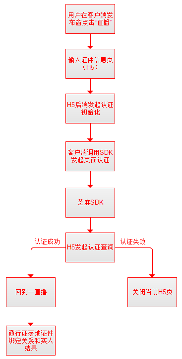

# 登录注册模块交接
排期中的需求如下：
## 接入芝麻实人认证
**对接人：** 刘剑易（直播产品）、刘泽希（UG产品）、宋伟（通行证）
UE见邮件。
**排期：** 2月8日
**主要实现：**


流程图如下：
```flow
st=>start: Start
op=>operation: 用户在客户端发布窗点击“直播”
cond=>condition: H5查询是否认证成功？
e=>end

st->op->cond
cond(yes)->回道一直播
cond(no)->关闭当前H5页面
```



1. 接入芝麻认证，实现认证。
2. 提供API给直播认证完成。

[SDK接入文档](https://b.zmxy.com.cn/technology/openDocsView.htm?id=684956c8-405f-4ea9-a9b2-5cf5c6f9d4ca)


## 客户端上传设备信息
**PM：**

## 注册优化：新用户兴趣引导-新户场景接入二级标签
**PM：** 李怡璐


## today widget 调整方案
**PM：** 陈志刚


## 截图分享功能（已完成）
**PM：** 谢凯鑫、田月

## Universal link